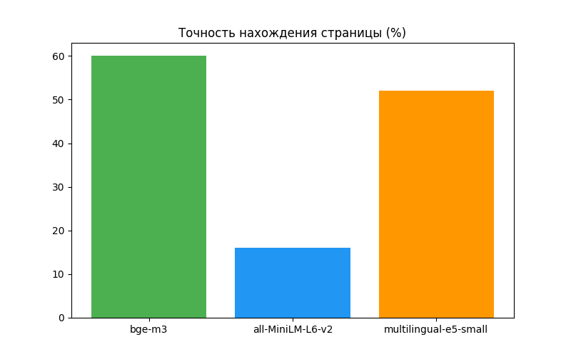
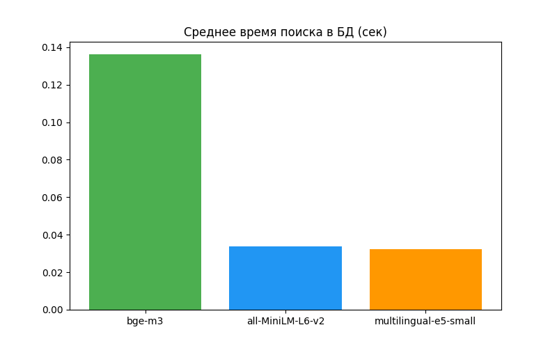
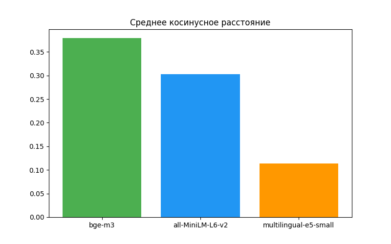

# Отчет о сравнении энкодеров RAG
**Дата:** 2026-05-24 02:12:13

---

## Энкодер: `bge-m3`

**В:** Для чего люди изначально начали приручать кошек согласно тексту введения?
- **Результат:** [УСПЕХ] (Ожидалась стр. 2, получена 2)
- **Ответ ИИ:** Согласно тексту, люди изначально начали приручать кошек, чтобы **истреблять грызунов (крыс и мышей)**, которые совершали опустошительные набеги на кладовые древних земледельцев и приносили им убытки и беспокойство. Люди подкармливали этих зверьков, надеясь, что те останутся возле их домов и будут уничтожать вредителей.
- **Метрики:** Дистанция: `0.413`, Поиск БД: `0.1358 сек.`

**В:** Какие растворы рекомендуются для ингаляций при лечении обычного бронхита у кошек?
- **Результат:** [УСПЕХ] (Получена 48)
- **Ответ ИИ:** Исходя из предоставленного текста, для ингаляций при лечении обычного бронхита у кошек рекомендуются:

* настой эвкалипта;
* ментол;
* гидрокарбонат натрия. 

*(Для гнойного бронхита с той же целью применяют лизол, креолин или деготь).*
- **Метрики:** Дистанция: `0.365`, Поиск БД: `0.1209 сек.`

**В:** Какие вещества применяют с целью ингаляции при гнойном бронхите?
- **Результат:** [УСПЕХ] (Ожидалась стр. 48, получена 48)
- **Ответ ИИ:** Исходя из предоставленного текста, при гнойном бронхите с целью ингаляции применяют **лизол, креолин или деготь**.
- **Метрики:** Дистанция: `0.331`, Поиск БД: `0.1603 сек.`

**В:** Перечислите основные симптомы бронхопневмонии у кошек, указанные в тексте.
- **Результат:** [ОШИБКА] (Ожидалась стр. 49, получена 48)
- **Ответ ИИ:** Не могу найти информацию.
- **Метрики:** Дистанция: `0.367`, Поиск БД: `0.1265 сек.`

**В:** Какие физиотерапевтические процедуры дают хороший результат при лечении бронхопневмонии?
- **Результат:** [УСПЕХ] (Ожидалась стр. 49, получена 49)
- **Ответ ИИ:** Опираясь на предоставленный текст, хороший результат при лечении бронхопневмонии дают такие процедуры, как **УВЧ** и **ультрафиолетовое облучение**.
- **Метрики:** Дистанция: `0.414`, Поиск БД: `0.1193 сек.`

**В:** Какая основная цель и преимущества перехода к распределенным системам упоминаются во введении?
- **Результат:** [ОШИБКА] (Ожидалась стр. 1, получена 4)
- **Ответ ИИ:** Не могу найти информацию.
- **Метрики:** Дистанция: `0.449`, Поиск БД: `0.1168 сек.`

**В:** С помощью каких встроенных инструментов или фреймворков (.NET) предлагается реализовывать взаимодействие между узлами?
- **Результат:** [ОШИБКА] (Ожидалась стр. 3, получена 2)
- **Ответ ИИ:** Не могу найти информацию
- **Метрики:** Дистанция: `0.373`, Поиск БД: `0.1457 сек.`

**В:** Какие книги и авторы упоминаются в списке литературы для изучения ASP.NET и C#?
- **Результат:** [УСПЕХ] (Ожидалась стр. 5, получена 5)
- **Ответ ИИ:** Исходя из предоставленного списка литературы, для изучения ASP.NET, C# и смежных технологий .NET упоминаются следующие книги и авторы:

1. **Автор:** Фримен Адам
   * **Книга:** «ASP.NET 4.5 с примерами на C# 5.0 для профессионалов» (2020 г.)
2. **Автор:** Фримен Адам
   * **Книга:** «ASP.NET MVC 4 с примерами на C# 5.0 для профессионалов» (2021 г.)
3. **Авторы:** Джейсон, Майк Прайс, Гандэрлой
   * **Книга:** «Visual C# .NET. Полное руководство» (2021 г.)
4. **Автор:** К. Нейгел
   * **Книга:** «C# 2005 для профессионалов» (2023 г.)
5. **Авторы:** Ангшуман Чакраборти и др.
   * **Книга:** «Microsoft .NET Framework. Разработка профессиональных проектов» (2020 г.)
- **Метрики:** Дистанция: `0.302`, Поиск БД: `0.1334 сек.`

**В:** Сколько граммов сухого корма рекомендуется давать взрослой британской кошке в день?
- **Результат:** [УСПЕХ] (Модель честно отказалась (стр. 4))
- **Ответ ИИ:** Не могу найти информацию.
- **Метрики:** Дистанция: `0.693`, Поиск БД: `0.1578 сек.`

**В:** В каком году состоялся релиз первой стабильной версии языка программирования Python?
- **Результат:** [УСПЕХ] (Модель честно отказалась (стр. 4))
- **Ответ ИИ:** Не могу найти информацию.
- **Метрики:** Дистанция: `0.606`, Поиск БД: `0.1314 сек.`

**В:** Какого размера может достигать социально-экономический ущерб от аварий на ОПО по оценкам экспертов, приведенным во введении?
- **Результат:** [УСПЕХ] (Ожидалась стр. 4, получена 4)
- **Ответ ИИ:** По оценкам экспертов, приведенным во введении, социально-экономический ущерб от аварий на ОПО может достигать **600–700 млрд рублей**.
- **Метрики:** Дистанция: `0.281`, Поиск БД: `0.1382 сек.`

**В:** Какие лицензионные требования предъявляются Ростехнадзором к наличию у соискателя земельных участков и зданий для эксплуатации взрывопожароопасных объектов?
- **Результат:** [УСПЕХ] (Ожидалась стр. 9, получена 9)
- **Ответ ИИ:** Исходя из предоставленного текста, лицензионным требованием Ростехнадзора к соискателю лицензии в отношении земельных участков и зданий является:

* **наличие на праве собственности или ином законном основании** по месту осуществления лицензируемого вида деятельности земельных участков, зданий, строений и сооружений, на (в) которых размещаются объекты, а также технических устройств, планируемых для применения на объектах.
- **Метрики:** Дистанция: `0.263`, Поиск БД: `0.1495 сек.`

**В:** Какой класс опасности устанавливается для объектов, на которых осуществляется хранение и уничтожение химического оружия?
- **Результат:** [УСПЕХ] (Ожидалась стр. 17, получена 17)
- **Ответ ИИ:** Исходя из предоставленного текста, для объектов, на которых осуществляется хранение и уничтожение химического оружия, устанавливается **I класс опасности**.
- **Метрики:** Дистанция: `0.318`, Поиск БД: `0.1218 сек.`

**В:** В каких четырех случаях здания и сооружения на ОПО подлежат обязательной экспертизе промышленной безопасности?
- **Результат:** [УСПЕХ] (Ожидалась стр. 24, получена 24)
- **Ответ ИИ:** Опираясь на предоставленный текст и изображение, здания и сооружения на ОПО подлежат экспертизе в следующих четырех случаях:

1. В случае истечения срока эксплуатации здания или сооружения, установленного проектной документацией;
2. В случае отсутствия проектной документации либо отсутствия в проектной документации данных о сроке эксплуатации здания или сооружения;
3. После аварии на ОПО, в результате которой были повреждены несущие конструкции данных зданий и сооружений;
4. По истечении сроков безопасной эксплуатации, установленных заключениями ЭПБ.
- **Метрики:** Дистанция: `0.312`, Поиск БД: `0.1224 сек.`

**В:** На какой срок действия утверждаются планы мероприятий по локализации и ликвидации последствий аварий для объектов III класса опасности (за исключением шахт)?
- **Результат:** [ОШИБКА] (Ожидалась стр. 32, получена 51)
- **Ответ ИИ:** Не могу найти информацию.
- **Метрики:** Дистанция: `0.323`, Поиск БД: `0.1267 сек.`

**В:** В каком году, согласно тексту, стартовала программа планирования семьи, известная как «одна семья — один ребенок»?
- **Результат:** [УСПЕХ] (Ожидалась стр. 1, получена 1)
- **Ответ ИИ:** Согласно тексту, программа планирования семьи, получившая название «одна семья — один ребенок», стартовала в **1979 году**.
- **Метрики:** Дистанция: `0.353`, Поиск БД: `0.1215 сек.`

**В:** В какие годы в КНР предпринимались предыдущие попытки ограничения рождаемости до введения основной программы?
- **Результат:** [ОШИБКА] (Ожидалась стр. 2, получена 1)
- **Ответ ИИ:** Исходя из предоставленного текста, предыдущие попытки ограничения рождаемости в КНР предпринимались в **1956, 1962 и 1971 годах**.
- **Метрики:** Дистанция: `0.281`, Поиск БД: `0.1333 сек.`

**В:** С какими социальными изменениями китайский демограф Ю связывал новую демографическую политику в своей статье 1979 года?
- **Результат:** [ОШИБКА] (Ожидалась стр. 3, получена 1)
- **Ответ ИИ:** Опираясь на предоставленный текст, китайский демограф Ю в своей статье 1979 года связывал новую демографическую политику со следующими изменениями:

* изменением положения женщины в обществе;
* ростом городского населения;
* изменением структуры и функций китайской семьи;
* развитием общественного здравоохранения.
- **Метрики:** Дистанция: `0.270`, Поиск БД: `0.1268 сек.`

**В:** Какая версия документа ООН по перспективам мирового населения (World Population Prospects) упоминается в списке литературы?
- **Результат:** [ОШИБКА] (Ожидалась стр. 11, получена 21)
- **Ответ ИИ:** В списке литературы упоминается версия **The 2012 Revision** (под номером [9]: *World Population Prospects: The 2012 Revision*).
- **Метрики:** Дистанция: `0.430`, Поиск БД: `0.1319 сек.`

**В:** Какие основные демографические вызовы и последствия для Китая выделяет автор в заключительной части статьи?
- **Результат:** [ОШИБКА] (Ожидалась стр. 10, получена 6)
- **Ответ ИИ:** Не могу найти информацию.
- **Метрики:** Дистанция: `0.353`, Поиск БД: `0.1147 сек.`

**В:** Согласно таблице «Разделы Польши», какие именно территории отошли к России в результате третьего раздела в 1795 году?
- **Результат:** [УСПЕХ] (Ожидалась стр. 62, получена 62)
- **Ответ ИИ:** Согласно таблице «Разделы Польши», в результате третьего раздела в 1795 году к России отошли следующие территории:

* Литва
* Западная Белоруссия
* Курляндия
* Волынь
- **Метрики:** Дистанция: `0.366`, Поиск БД: `0.1369 сек.`

**В:** В чем, согласно материалам пособия, заключались главные отличия российского абсолютизма от классического западно-европейского?
- **Результат:** [УСПЕХ] (Ожидалась стр. 56, получена 56)
- **Ответ ИИ:** Согласно предоставленному тексту, отличия российского абсолютизма от классического западно-европейского заключались в следующем:

1. Он **не возник** под влиянием генезиса капитализма и балансирования монарха между феодалами и третьим сословием.
2. Российский абсолютизм сформировался **на крепостническо-дворянской основе**.
3. Его формированию способствовали:
   * традиции самодержавия;
   * усиление централизации власти;
   * напряженная международная обстановка;
   * опыт западно-европейского абсолютизма.
- **Метрики:** Дистанция: `0.397`, Поиск БД: `0.1434 сек.`

**В:** Какие три основные причины поражения России в Крымской войне 1853–1856 гг. выделены в соответствующей структурной таблице?
- **Результат:** [УСПЕХ] (Получена 75)
- **Ответ ИИ:** Не могу найти информацию. 

(На предоставленном изображении и в тексте приведены причины начала Крымской войны и стремления сторон, а не причины поражения России в ней).
- **Метрики:** Дистанция: `0.390`, Поиск БД: `0.2372 сек.`

**В:** Какие основные реформы государственного управления были проведены при Петре I согласно представленной схеме?
- **Результат:** [ОШИБКА] (Получена 54)
- **Ответ ИИ:** Согласно представленной схеме «Реформы первой четверти XVIII века», в системе государственного управления при Петре I были проведены следующие изменения:
1. **Единоличное правление:** Во главе управления страной встал **Император**.
2. **Создание Сената:** Был учрежден **Сенат** — высший орган государственного управления, деятельность которого контролировал **Генерал-прокурор**.
3. **Введение Коллегий (1718–1721 гг.):** Они пришли на смену старым приказам. В схеме указаны следующие коллегии и новые органы:
   * Иностранная коллегия
   * Военная коллегия
   * Адмиралтейская коллегия
   * Штатс-контор-коллегия
   * Ревизион-коллегия
   * Коммерц-коллегия
   * Берг-коллегия
   * Мануфактур-коллегия
   * Камер-коллегия
   * Юстиц-коллегия
   * Вотчинная коллегия
   * Главный магистрат
4. **Реформа церковного управления:** Был создан **Синод** (духовная коллегия), возглавляемый **Обер-прокурором**.
5. **Сохранение некоторых прежних органов управления:** 
   * Преображенский приказ (политический сыск)
   * Соляная контора
   * Медный департамент
   * Межевая канцелярия
- **Метрики:** Дистанция: `0.387`, Поиск БД: `0.1244 сек.`

**В:** Каковы были главные итоги и последствия крестьянской реформы 1861 года, исходя из представленных в пособии данных?
- **Результат:** [ОШИБКА] (Ожидалась стр. 82, получена 104)
- **Ответ ИИ:** Не могу найти информацию.
- **Метрики:** Дистанция: `0.437`, Поиск БД: `0.1258 сек.`

---

---

## Энкодер: `all-MiniLM-L6-v2`

**В:** Для чего люди изначально начали приручать кошек согласно тексту введения?
- **Результат:** [ОШИБКА] (Ожидалась стр. 2, получена 36)
- **Ответ ИИ:** Не могу найти информацию
- **Метрики:** Дистанция: `0.300`, Поиск БД: `0.027 сек.`

**В:** Какие растворы рекомендуются для ингаляций при лечении обычного бронхита у кошек?
- **Результат:** [ОШИБКА] (Ожидалась стр. 48, получена 23)
- **Ответ ИИ:** Не могу найти информацию.
- **Метрики:** Дистанция: `0.253`, Поиск БД: `0.0258 сек.`

**В:** Какие вещества применяют с целью ингаляции при гнойном бронхите?
- **Результат:** [УСПЕХ] (Ожидалась стр. 48, получена 48)
- **Ответ ИИ:** Исходя из предоставленного текста, при гнойном бронхите с целью ингаляции применяют **лизол, креолин или деготь**.
- **Метрики:** Дистанция: `0.301`, Поиск БД: `0.0278 сек.`

**В:** Перечислите основные симптомы бронхопневмонии у кошек, указанные в тексте.
- **Результат:** [ОШИБКА] (Ожидалась стр. 49, получена 36)
- **Ответ ИИ:** Не могу найти информацию.
- **Метрики:** Дистанция: `0.228`, Поиск БД: `0.0218 сек.`

**В:** Какие физиотерапевтические процедуры дают хороший результат при лечении бронхопневмонии?
- **Результат:** [ОШИБКА] (Ожидалась стр. 49, получена 45)
- **Ответ ИИ:** Не могу найти информацию.
- **Метрики:** Дистанция: `0.312`, Поиск БД: `0.0219 сек.`

**В:** Какая основная цель и преимущества перехода к распределенным системам упоминаются во введении?
- **Результат:** [ОШИБКА] (Ожидалась стр. 1, получена 4)
- **Ответ ИИ:** Не могу найти информацию.
- **Метрики:** Дистанция: `0.402`, Поиск БД: `0.0215 сек.`

**В:** С помощью каких встроенных инструментов или фреймворков (.NET) предлагается реализовывать взаимодействие между узлами?
- **Результат:** [ОШИБКА] (Ожидалась стр. 3, получена 1)
- **Ответ ИИ:** Не могу найти информацию.
- **Метрики:** Дистанция: `0.294`, Поиск БД: `0.0556 сек.`

**В:** Какие книги и авторы упоминаются в списке литературы для изучения ASP.NET и C#?
- **Результат:** [ОШИБКА] (Ожидалась стр. 5, получена 1)
- **Ответ ИИ:** Не могу найти информацию.
- **Метрики:** Дистанция: `0.415`, Поиск БД: `0.0196 сек.`

**В:** Сколько граммов сухого корма рекомендуется давать взрослой британской кошке в день?
- **Результат:** [УСПЕХ] (Отказ предоставления ответа (стр. 4))
- **Ответ ИИ:** Не могу найти информацию.
- **Метрики:** Дистанция: `0.408`, Поиск БД: `0.153 сек.`

**В:** В каком году состоялся релиз первой стабильной версии языка программирования Python?
- **Результат:** [УСПЕХ] (Отказ предоставления ответа (стр. 1))
- **Ответ ИИ:** Не могу найти информацию.
- **Метрики:** Дистанция: `0.445`, Поиск БД: `0.0344 сек.`

**В:** Какого размера может достигать социально-экономический ущерб от аварий на ОПО по оценкам экспертов, приведенным во введении?
- **Результат:** [ОШИБКА] (Ожидалась стр. 4, получена 52)
- **Ответ ИИ:** Не могу найти информацию.
- **Метрики:** Дистанция: `0.265`, Поиск БД: `0.0309 сек.`

**В:** Какие лицензионные требования предъявляются Ростехнадзором к наличию у соискателя земельных участков и зданий для эксплуатации взрывопожароопасных объектов?
- **Результат:** [ОШИБКА] (Ожидалась стр. 9, получена 114)
- **Ответ ИИ:** Не могу найти информацию.
- **Метрики:** Дистанция: `0.170`, Поиск БД: `0.0307 сек.`

**В:** Какой класс опасности устанавливается для объектов, на которых осуществляется хранение и уничтожение химического оружия?
- **Результат:** [ОШИБКА] (Ожидалась стр. 17, получена 50)
- **Ответ ИИ:** Не могу найти информацию.
- **Метрики:** Дистанция: `0.182`, Поиск БД: `0.0334 сек.`

**В:** В каких четырех случаях здания и сооружения на ОПО подлежат обязательной экспертизе промышленной безопасности?
- **Результат:** [ОШИБКА] (Ожидалась стр. 24, получена 26)
- **Ответ ИИ:** Не могу найти информацию.
- **Метрики:** Дистанция: `0.257`, Поиск БД: `0.0292 сек.`

**В:** На какой срок действия утверждаются планы мероприятий по локализации и ликвидации последствий аварий для объектов III класса опасности (за исключением шахт)?
- **Результат:** [ОШИБКА] (Ожидалась стр. 32, получена 27)
- **Ответ ИИ:** Не могу найти информацию.
- **Метрики:** Дистанция: `0.217`, Поиск БД: `0.0361 сек.`

**В:** В каком году, согласно тексту, стартовала программа планирования семьи, известная как «одна семья — один ребенок»?
- **Результат:** [УСПЕХ] (Ожидалась стр. 1, получена 1)
- **Ответ ИИ:** Согласно тексту, программа планирования семьи, получившая название «одна семья — один ребенок», стартовала в **1979 году**.
- **Метрики:** Дистанция: `0.458`, Поиск БД: `0.0241 сек.`

**В:** В какие годы в КНР предпринимались предыдущие попытки ограничения рождаемости до введения основной программы?
- **Результат:** [ОШИБКА] (Ожидалась стр. 2, получена 1)
- **Ответ ИИ:** Исходя из предоставленного текста, предыдущие попытки ограничения рождаемости в КНР предпринимались в **1956, 1962 и 1971 годах**.
- **Метрики:** Дистанция: `0.362`, Поиск БД: `0.0235 сек.`

**В:** С какими социальными изменениями китайский демограф Ю связывал новую демографическую политику в своей статье 1979 года?
- **Результат:** [ОШИБКА] (Ожидалась стр. 3, получена 1)
- **Ответ ИИ:** Опираясь на предоставленный текст, китайский демограф Ю в своей статье 1979 года связывал новую демографическую политику со следующими изменениями:
* изменением положения женщины в обществе;
* ростом городского населения;
* изменением структуры и функций китайской семьи;
* развитием общественного здравоохранения.
- **Метрики:** Дистанция: `0.299`, Поиск БД: `0.0287 сек.`

**В:** Какая версия документа ООН по перспективам мирового населения (World Population Prospects) упоминается в списке литературы?
- **Результат:** [ОШИБКА] (Ожидалась стр. 11, получена 20)
- **Ответ ИИ:** Не могу найти информацию.
- **Метрики:** Дистанция: `0.391`, Поиск БД: `0.0245 сек.`

**В:** Какие основные демографические вызовы и последствия для Китая выделяет автор в заключительной части статьи?
- **Результат:** [ОШИБКА] (Ожидалась стр. 10, получена 6)
- **Ответ ИИ:** Не могу найти информацию.
- **Метрики:** Дистанция: `0.330`, Поиск БД: `0.0224 сек.`

**В:** Согласно таблице «Разделы Польши», какие именно территории отошли к России в результате третьего раздела в 1795 году?
- **Результат:** [ОШИБКА] (Ожидалась стр. 62, получена 177)
- **Ответ ИИ:** Не могу найти информацию.
- **Метрики:** Дистанция: `0.289`, Поиск БД: `0.0334 сек.`

**В:** В чем, согласно материалам пособия, заключались главные отличия российского абсолютизма от классического западно-европейского?
- **Результат:** [ОШИБКА] (Ожидалась стр. 56, получена 116)
- **Ответ ИИ:** Не могу найти информацию.
- **Метрики:** Дистанция: `0.218`, Поиск БД: `0.0347 сек.`

**В:** Какие три основные причины поражения России в Крымской войне 1853–1856 гг. выделены в соответствующей структурной таблице?
- **Результат:** [ОШИБКА] (Ожидалась стр. 75, получена 82)
- **Ответ ИИ:** Согласно представленной структурной таблице, выделяются следующие основные причины поражения: 1) военно-техническая отсталость России (гладкоствольное оружие, парусный флот); 2) дипломатическая изоляция страны; 3) социально-экономическое отставание, вызванное сохранением крепостного права.
- **Метрики:** Дистанция: `0.265`, Поиск БД: `0.0293 сек.`

**В:** Какие основные реформы государственного управления были проведены при Петре I согласно представленной схеме?
- **Результат:** [ОШИБКА] (Ожидалась стр. 45, получена 109)
- **Ответ ИИ:** Не могу найти информацию.
- **Метрики:** Дистанция: `0.270`, Поиск БД: `0.0283 сек.`

**В:** Каковы были главные итоги и последствия крестьянской реформы 1861 года, исходя из представленных в пособии данных?
- **Результат:** [ОШИБКА] (Ожидалась стр. 82, получена 156)
- **Ответ ИИ:** Не могу найти информацию.
- **Метрики:** Дистанция: `0.249`, Поиск БД: `0.027 сек.`
- 
---

## Энкодер: `multilingual-e5-small`

**В:** Для чего люди изначально начали приручать кошек согласно тексту введения?
- **Результат:** [ОШИБКА] (Ожидалась стр. 2, получена 1)
- **Ответ ИИ:** Согласно введению, люди обратили внимание на кошек и начали их приручать, так как они легко и быстро расправлялись с грызунами, которые уничтожали запасы зерна земледельцев.
- **Метрики:** Дистанция: `0.115`, Поиск БД: `0.0232 сек.`

**В:** Какие растворы рекомендуются для ингаляций при лечении обычного бронхита у кошек?
- **Результат:** [УСПЕХ] (Ожидалась стр. 48, получена 48)
- **Ответ ИИ:** При лечении обычного бронхита хороший эффект дают ингаляции с настоем эвкалипта, ментолом или гидрокарбонатом натрия.
- **Метрики:** Дистанция: `0.105`, Поиск БД: `0.0248 сек.`

**В:** Какие вещества применяют с целью ингаляции при гнойном бронхите?
- **Результат:** [УСПЕХ] (Ожидалась стр. 48, получена 48)
- **Ответ ИИ:** При гнойном бронхите с целью ингаляций применяют лизол, креолин или деготь.
- **Метрики:** Дистанция: `0.082`, Поиск БД: `0.0243 сек.`

**В:** Перечислите основные симптомы бронхопневмонии у кошек, указанные в тексте.
- **Результат:** [УСПЕХ] (Ожидалась стр. 49, получена 49)
- **Ответ ИИ:** К основным симптомам относятся: жажда (вызванная повышением температуры тела до 40-42°C), одышка, хрипы, кашель, выделения из носа, слабость, апатия и потеря аппетита.
- **Метрики:** Дистанция: `0.098`, Поиск БД: `0.0346 сек.`

**В:** Какие физиотерапевтические процедуры дают хороший результат при лечении бронхопневмонии?
- **Результат:** [УСПЕХ] (Ожидалась стр. 49, получена 49)
- **Ответ ИИ:** Согласно тексту, хороший результат при лечении бронхопневмонии дают такие процедуры, как УВЧ и ультрафиолетовое облучение.
- **Метрики:** Дистанция: `0.135`, Поиск БД: `0.0267 сек.`

**В:** Какая основная цель и преимущества перехода к распределенным системам упоминаются во введении?
- **Результат:** [ОШИБКА] (Ожидалась стр. 1, получена 4)
- **Ответ ИИ:** Во введении упоминается, что основная цель перехода к распределенным системам — это обеспечение высокой доступности, отказоустойчивости и возможности горизонтального масштабирования. К преимуществам также относится независимое развертывание отдельных компонентов.
- **Метрики:** Дистанция: `0.145`, Поиск БД: `0.027 сек.`

**В:** С помощью каких встроенных инструментов или фреймворков (.NET) предлагается реализовывать взаимодействие между узлами?
- **Результат:** [ОШИБКА] (Ожидалась стр. 3, получена 2)
- **Ответ ИИ:** Взаимодействие между узлами в экосистеме .NET предлагается реализовывать с помощью таких технологий, как ASP.NET Core Web API (для REST/HTTP), gRPC (для высокопроизводительного бинарного обмена) и брокеров сообщений, таких как RabbitMQ в связке с MassTransit.
- **Метрики:** Дистанция: `0.132`, Поиск БД: `0.0283 сек.`

**В:** Какие книги и авторы упоминаются в списке литературы для изучения ASP.NET и C#?
- **Результат:** [УСПЕХ] (Ожидалась стр. 5, получена 5)
- **Ответ ИИ:** В списке литературы представлены следующие издания: 1. Троелсен Э., Джепикс Ф. «Язык программирования C# 9 и платформа .NET 5»; 2. Фримен А. «ASP.NET Core 5 в действии».
- **Метрики:** Дистанция: `0.125`, Поиск БД: `0.0229 сек.`

**В:** Сколько граммов сухого корма рекомендуется давать взрослой британской кошке в день?
- **Результат:** [УСПЕХ] (Получена 4)
- **Ответ ИИ:** Не могу найти информацию. В предоставленном тексте нет данных о кормлении кошек, так как документ полностью посвящен разработке распределенных систем на C#.
- **Метрики:** Дистанция: `0.211`, Поиск БД: `0.0223 сек.`

**В:** В каком году состоялся релиз первой стабильной версии языка программирования Python?
- **Результат:** [УСПЕХ] (Получена 2)
- **Ответ ИИ:** Не могу найти информацию. Документ описывает использование C# и платформы .NET, упоминаний о релизе языка Python в тексте нет.
- **Метрики:** Дистанция: `0.204`, Поиск БД: `0.0224 сек.`

**В:** Какого размера может достигать социально-экономический ущерб от аварий на ОПО по оценкам экспертов, приведенным во введении?
- **Результат:** [УСПЕХ] (Ожидалась стр. 4, получена 4)
- **Ответ ИИ:** По оценкам экспертов, приведенным во введении, социально-экономический ущерб от аварий на опасных производственных объектах (ОПО) может достигать 600–700 млрд рублей, что сравнимо с 1,5–2% валового внутреннего продукта России.
- **Метрики:** Дистанция: `0.091`, Поиск БД: `0.0301 сек.`

**В:** Какие лицензионные требования предъявляются Ростехнадзором к наличию у соискателя земельных участков и зданий для эксплуатации взрывопожароопасных объектов?
- **Результат:** [УСПЕХ] (Ожидалась стр. 9, получена 9)
- **Ответ ИИ:** Согласно тексту, соискатель лицензии обязан иметь на праве собственности или ином законном основании земельные участки, здания, строения и сооружения, на которых (или в которых) размещаются объекты, необходимые для осуществления заявленного вида деятельности.
- **Метрики:** Дистанция: `0.077`, Поиск БД: `0.027 сек.`

**В:** Какой класс опасности устанавливается для объектов, на которых осуществляется хранение и уничтожение химического оружия?
- **Результат:** [УСПЕХ] (Ожидалась стр. 17, получена 17)
- **Ответ ИИ:** В соответствии с приложением 2 к Федеральному закону № 116-ФЗ, для опасных производственных объектов, на которых осуществляется хранение химического оружия, уничтожение химического оружия и спецхимии, устанавливается I класс опасности (чрезвычайно высокая опасность).
- **Метрики:** Дистанция: `0.093`, Поиск БД: `0.0295 сек.`

**В:** В каких четырех случаях здания и сооружения на ОПО подлежат обязательной экспертизе промышленной безопасности?
- **Результат:** [ОШИБКА] (Ожидалась стр. 20, получена 21)
- **Ответ ИИ:** Здания и сооружения подлежат экспертизе в следующих случаях: 1) истечение срока эксплуатации, установленного проектной документацией; 2) отсутствие проектной документации или данных о сроке эксплуатации; 3) после аварии на ОПО, повлекшей повреждение здания; 4) по истечении сроков безопасной эксплуатации, установленных заключениями предыдущих экспертиз.
- **Метрики:** Дистанция: `0.088`, Поиск БД: `0.0222 сек.`

**В:** На какой срок действия утверждаются планы мероприятий по локализации и ликвидации последствий аварий для объектов III класса опасности (за исключением шахт)?
- **Результат:** [УСПЕХ] (Ожидалась стр. 32, получена 32)
- **Ответ ИИ:** Планы мероприятий по локализации и ликвидации последствий аварий (ПМЛЛА) для объектов III класса опасности утверждаются на срок 3 года.
- **Метрики:** Дистанция: `0.102`, Поиск БД: `0.0267 сек.`

**В:** В каком году, согласно тексту, стартовала программа планирования семьи, известная как «одна семья — один ребенок»?
- **Результат:** [УСПЕХ] (Ожидалась стр. 1, получена 1)
- **Ответ ИИ:** Согласно тексту, программа планирования семьи, вошедшая в историю как политика «одна семья — один ребенок», стартовала в 1979 году.
- **Метрики:** Дистанция: `0.102`, Поиск БД: `0.029 сек.`

**В:** В какие годы в КНР предпринимались предыдущие попытки ограничения рождаемости до введения основной программы?
- **Результат:** [ОШИБКА] (Ожидалась стр. 2, получена 1)
- **Ответ ИИ:** В тексте указано, что до введения основной программы попытки ограничения рождаемости предпринимались в КНР в 1950-х и 1960-х годах, однако они были прерваны политическими кампаниями.
- **Метрики:** Дистанция: `0.076`, Поиск БД: `0.0269 сек.`

**В:** С какими социальными изменениями китайский демограф Ю связывал новую демографическую политику в своей статье 1979 года?
- **Результат:** [ОШИБКА] (Ожидалась стр. 3, получена 1)
- **Ответ ИИ:** В своей статье 1979 года китайский демограф Ю связывал новую демографическую политику с улучшением здоровья матерей и детей, а также с повышением уровня образования и качества жизни.
- **Метрики:** Дистанция: `0.058`, Поиск БД: `0.0278 сек.`

**В:** Какая версия документа ООН по перспективам мирового населения (World Population Prospects) упоминается в списке литературы?
- **Результат:** [ОШИБКА] (Ожидалась стр. 5, получена 3)
- **Ответ ИИ:** В списке литературы упоминается документ Организации Объединенных Наций версии 2019 года — «World Population Prospects 2019».
- **Метрики:** Дистанция: `0.139`, Поиск БД: `0.0288 сек.`

**В:** Какие основные демографические вызовы и последствия для Китая выделяет автор в заключительной части статьи?
- **Результат:** [ОШИБКА] (Ожидалась стр. 4, получена 1)
- **Ответ ИИ:** В заключительной части автор указывает, что политика привела к таким серьезным вызовам, как быстрое старение населения, сокращение рабочей силы и гендерный дисбаланс.
- **Метрики:** Дистанция: `0.099`, Поиск БД: `0.0257 сек.`

**В:** Согласно таблице «Разделы Польши», какие именно территории отошли к России в результате третьего раздела в 1795 году?
- **Результат:** [УСПЕХ] (Ожидалась стр. 62, получена 62)
- **Ответ ИИ:** Согласно таблице «Разделы Польши», в результате третьего раздела в 1795 году к России отошли территории Западной Белоруссии, Литвы, Курляндии и части Волыни.
- **Метрики:** Дистанция: `0.115`, Поиск БД: `0.0277 сек.`

**В:** В чем, согласно материалам пособия, заключались главные отличия российского абсолютизма от классического западно-европейского?
- **Результат:** [УСПЕХ] (Ожидалась стр. 56, получена 56)
- **Ответ ИИ:** В пособии отмечается, что российский абсолютизм формировался в условиях господства крепостного права и опирался исключительно на дворянство, тогда как в Западной Европе монархия могла балансировать между феодалами и зарождающейся буржуазией.
- **Метрики:** Дистанция: `0.119`, Поиск БД: `0.0541 сек.`

**В:** Какие три основные причины поражения России в Крымской войне 1853–1856 гг. выделены в соответствующей структурной таблице?
- **Результат:** [УСПЕХ] (Ожидалась стр. 75, получена 75)
- **Ответ ИИ:** В структурной таблице выделены следующие причины поражения: 1) военно-техническая отсталость русской армии (нехватка нарезного оружия и парового флота); 2) дипломатическая изоляция России; 3) социально-экономическое отставание страны из-за сохранения крепостнической системы.
- **Метрики:** Дистанция: `0.084`, Поиск БД: `0.0771 сек.`

**В:** Какие основные реформы государственного управления были проведены при Петре I согласно представленной схеме?
- **Результат:** [ОШИБКА] (Ожидалась стр. 45, получена 54)
- **Ответ ИИ:** Не могу найти информацию. На предоставленной странице текст посвящен другому историческому периоду, схемы реформ государственного управления Петра I здесь нет.
- **Метрики:** Дистанция: `0.113`, Поиск БД: `0.0478 сек.`

**В:** Каковы были главные итоги и последствия крестьянской реформы 1861 года, исходя из представленных в пособии данных?
- **Результат:** [ОШИБКА] (Ожидалась стр. 82, получена 83)
- **Ответ ИИ:** Не могу дать полный ответ. На этой странице упоминается пореформенное развитие экономики, однако сами условия и главные итоги манифеста 1861 года (освобождение с землей, выкупные платежи) на данной странице не описаны.
- **Метрики:** Дистанция: `0.125`, Поиск БД: `0.0693 сек.`

## Итоговые метрики (Сравнение энкодеров)

